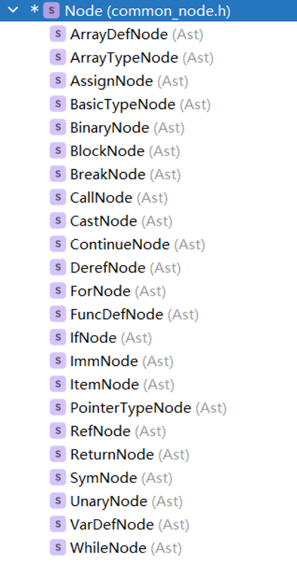
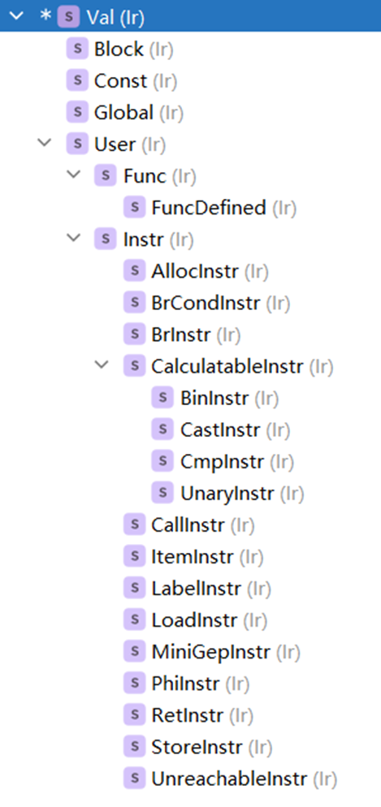
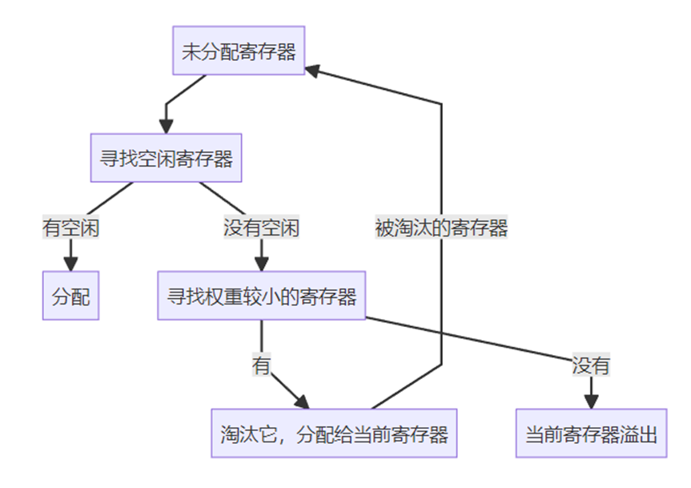
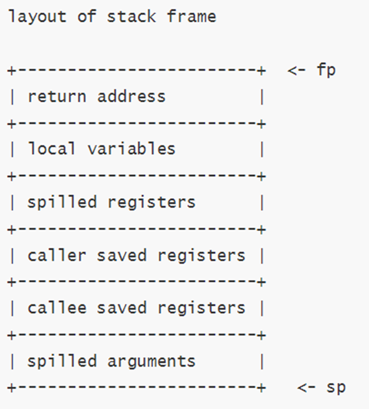

# 编编又译译

## 前端

前端采用 Lex+Yacc 生成的 sysy 解析器解析源代码，并在语义子程序中生成 AST。

AST 呈树状结构，可以较为容易的递归地生成 IR。



注意，其中的 ArrayTypeNode 是针对前端无法判断数组真实类型而设计的节点，后文会提及。

对于 `starttime` 和 `stoptime` 两调用，将会在前端被展开为 `_sysy_starttime(真实行号)` 和 `_sysy_stoptime(真实行号)`

## 中端

### 架构设计

#### Define-Use 链

在设计时，我们参考 LLVM-IR 的设计，使用类 Val 和类 User 分别代表可以被使用的类基类和可以使用别的值的类基类。实现此功能的意义在于能够替换某个值。例如：

```C++
%1 = add i32 0, i32 1
%2 = add i32 %1, i32 2
```

我们发现 %1 是常量 `1`，那么我们只需要执行

```C++
instr_1.replace_self(make_constant(ImmValue(1)));
```

代码就会变成

```C++
%1 = add i32 0, i32 1
%2 = add i32 1, i32 2
```

同时，封装为 Val 类和 User 类也有利于后续逻辑设计，所有的 def-use 链条由两基类自动管理，只要使用得当就几乎不会出错。

#### 类设计



类设计遵从的原则是：

1. Val 是所有出现在中端的元素的基类，表示能够被 use 的对象
2. User 是中端中所有可以使用别的元素的基类，表示能够 use 的对象
3. 所有的 Instruction 都是 User
4. Block、Const（即常量）、Global（即全局变量）都是 Val
5. CalculateableInstr 是可以编译时可以进行计算的 IR，具有可以编译期求值的特性

所有的 Instr 都或多或少和 LLVM-IR 互相对应，例如 CastInstr 同时对应了 LLVM-IR 中的：

- bitcast
- sitofp/fptosi
- ......

并且，我们的中端保证，我们的 IR 可以输出为 LLVM-IR。

这里需要特殊说明的是 Func 类和 FuncDefined 类，其中 Func 类是某函数的声明，用于引入外部函数，而 FuncDefined 是有定义的函数，继承自 Func，两者都可以作为 CallInstr 的 usee

#### 动态类型翻译

不是所有的类型都能在前端确定，例如：

```C++
int a[1+2+3];
```

在前端中，将所谓的 `int[1+2+3]` 单独计为节点 `ArrayTypeNode`，并且在中端中进行实际计算，得到其类型为 `int[6]`。

#### 左右值处理

由于 sysy 语言本身的特性，我们使用简单的规则如此处理左右值：

1. 所有出现在`=`左侧的值都**被看作**左值
2. 所有出现在`=`右侧的值都**被看作**右值
3. 解释右值时，先当作左值解释，然后将其当作地址，load 出的结果当作右值
4. 在调用函数时，通过所需的参数类型来推导实参所需的类型，例如数组和某个 `int` 类型的变量，其在 IR 中的类型都是 `i32*`，在调用函数时，通过所需的参数类型是 `i32` 还是 `i32*`来决定需要将此 `i32*`类型的 IR 当作数组还是某个左值并且取 load。

在我们的某些版本的实现中，一维数组的类型将会是 `[N x i32]*`而不是`i32*`，此时可以忽略第四点。

#### 常量处理

若一个值被声明为常量，那么在实现中：

1. 若该值是基本类型，那么其不能作左值
2. 若该值是数组，那么其寻址后的结果不能作左值

#### 控制块、函数体

每个 FuncDefined 具有类 BlockedProgram 对 CFG 进行管理，其中控制块用 Block 表示，其满足：

1. 一定由一个 LabelInstr 开头
2. 一定由一个 terminator 结尾，即：
   1. Ret
   2. Branch
   3. Conditional branch
   4. Unreachable

其中，Block 和 BlockedProgram 利用了 container 的设计理念，BlockedProgram-Block-Instruction 关系由类自己维护，无需手动修改和维护。

在此基础上，采用智能指针对这些数据进行维护，即可实现自动释放被删除的指令，防止内存泄漏。

#### 全局变量

全局变量用 Global 类进行存放，在后端翻译中，可以直接对接为 .data 段中的内容。

考虑到 LLVM-IR 的全局变量初始化方法比较抽象，输出为 LLVM-IR 时，采用生成函数 __buildin_initializer（名字故意打错的）对全局变量进行初始化，在后端程序开始时，删去该函数

### 优化

#### 基本块优化

基本块优化分为四类：

1. 当一个基本块 A 的 out block 只有另一个基本块 B，且 B 的 in block 仅有 A，那么合并 AB 两块
2. 当一个基本块 A 的末尾为 conditional branch，并且 condition 为常数，那么将 conditional branch 修改为 branch
3. 当一个基本块 A 内只有两条语句，即 label 语句和 branch 语句时，将 A 的 in block 直接链接到 A 的 out block 上，然后删去 A
4. 删去除了 entry block 以外没有 in block 的块

#### 无引用的死代码消除

这里的无引用死代码，指代其本身不作为其他指令的 use 而存在的指令。由于其值没有被使用，因此可以被安全删除。注意这里的例外：

1. call 指令。除了 pure function，所有的 call 指令不能删除
2. 控制流语句。所有的控制流语句，例如 branch、label 等指令，本身就不会被使用，因此不得删除。
3. store 指令。该指令是有后效性的，不能删去。

#### 纯函数识别

纯函数是只要输入相同，输出就一定相同，且不改变任何外部状态的函数。即无后效性、无副作用的函数。

我们判断纯函数的依据是：

- 参数必须是基本类型
- 所有指针运算不访问全局变量
- 调用的所有函数都是纯函数
  - 外部函数一律视为不纯
  - 递归调用不影响函数是否为纯函数

#### 数据流分析

数据流分析分为两部分：

1. 常量传播。进行常量传播后，由于 SSA 的特性不会出现某个虚拟寄存器在不同的块间具有不同的值，因此可以直接将识别为常量的虚拟寄存器替换为常量
2. 死代码消除。这里的死代码特指没有用的 store 指令，因为在常量传播中，将 store 的数据常量化无益于 store 的自然删除，因此必须要通过额外的数据流分析删除无用的 store 指令

#### 指令合并

用代数恒等变换，对于一些简单的算术运算指令进行合并，能有减少代码量，主要包括：

- 加零、减零、或零、异或零，乘一、除一的消除
- 乘零、与零的消除
- 先零拓展再位运算可以改为先位运算再零拓展
- n个+k可以合并为+kn
- 先加再减相同的数可以抵消，先乘再除相同的数可以抵消

#### 循环分析

##### LoopInfo

循环分析基于的是backedge所确定的natural loop。Natural loop是CFG的满足如下性质的子图:

1. 这个导出子图是强联通的
2. 所有从loop外进来的边都指向同一个节点, **loop header。**因此loop header支配了loop 中的所有节点。
3. 这个循环是一个极大子集。加入任何节点不可能使得导出子图是联通的同时还不改变loop header

> Natural Loop的确定

Natural Loop的计算基于的是backedge相关的数据流关系也就是满足如下关系的基本块被视为一个backedge:

$$\begin{equation} \{ (A, B) \mid B\rightarrow A \land B\ll A \} \nonumber \end{equation}$$

我们把B称之为latch，而A就是loop header。然后从latch reverse dfs寻找被 A 支配的节点加入循环块

```C++
while ( i < 3) {
    if ( i < 1) {
        i = i + 1;
        continue; 
    } else  {
        i = i + 2;
    }
}
```

此时会有两个latch指向 header我们将这两latch同时并入一个loop body。

##### Induction Variable

得到每个循环的header和循环的block后我们可以尝试提取Induction Variable来将更多的循环内强度递减或者优化地址计算。一个基础的induction variable就是loop header的判断条件变量，也就是

$$X \equiv \langle v op c \rangle$$,其中 v,c必有一个是loop-invariance。否则该循环不能保证其终止。循环不变量被定义为bound，另一个值v则是 induction variable。注意到如下的事实，v一定不是一个instrinsically pure instruction。其定义在loop以外被dominated但是又不是loop-invariance所以不可能成立。

#### SSA形式

##### **SSA construction**

SSA_pass 的 reconstruct变换参照[Simple and Efficient Construction of Static Single Assignment Form](https://doi.org/10.1007/978-3-642-37051-9_6) 实现

> IR相关的前提条件

- Lhs 本身就是Instr的 val, 所以对于同一个变量的读写不支持mv指令形式，而是参照LLVM采用stack address的store/load实现相同的效果。
- 使用mv能够就地将每个variable的defintion显式定义，并用Cytron的minimal-ssa 算法实现reg2mem
- Braun et al.的实现不需要额外的数据流分析，而且不依赖mv也能较为容易的实现

> 算法的High-level:

1. 将所有可能被读写的variable预先处理，形成一个alloca * 的池。
2. 如若存在对variable的 store, 则对当前 blk-var-def的表存下在此blk的var的 def 

```C++
void SSA_pass::def_val(Ir::Val *variable, Ir::Block *block, Ir::Val *blk_def_val);
```

1. 如若存在对variable的 load, 则对当前blk-var-def的表询问在此blk的var的def。

   1. 如果查询命中则对load所有的use被替换为当前的def。

   2. 如果查询未命中则该块插入对当前var的写入的phi指令实现def。

   3. ```C++
      Ir::Val *SSA_pass::use_val(Ir::Val *variable, Ir::Block *block);
      Ir::Val *SSA_pass::use_val_recursive(Ir::Val *variable, Ir::Block *block);
      ```

##### SealBlock与Phi

use_val_recursive的会根据block被seal的情况选择何时加入phi operand

1. 所有的sealed block都可以为当前的被插入的phi提供所有的operand。此时调用addPhiOperands填充
2. 当前block如果没有被sealed,那么phi会被插入 incomplete_phis等待当前block被seal再进行填充

Sealblock

当前block的所有predecessor都已经被seal则该块也会被seal。

##### Phi 指令的插入与消除

> 可以证明如下两种 phi的冗余性：

1. $$x = \phi v_1 v_1 \ldots v_1 \implies x = v_1$$ 
2. $$x = \phi x v_1 v_1 \ldots v_1 \implies x = v_1$$

> addPhiOperands 与就地折叠

在为phi 加入operand完成后会调用tryRemoveTrivialPhi 将这些trivial phi化为 $$x = v_1$$然后replace-self故每次在调用use_val_recursive时phi会被立即替换进行折叠。

#### 支配树构建

 CFG中的一个节点 A **dominates** 节点B, $$A \mathrm{dom} B \leftrightarrow (A\gg B )$$,如果从entry到B的所有路径都经过节点A.

Dom的关系形成了一个paritial order，并且有gub entry。

1. $$\forall A( A\ll A)$$
2. $$\forall A,B( (A\ll B \land B\ll A )\rightarrow (A = B))$$
3. $$\forall A,B,C( (A\ll B \land B \ll C)\rightarrow (A\ll C))$$

同一个节点的dominators形成了parital order的一条chain.

> $$\forall A,B,C( (C\ll A \land C\ll B) \rightarrow (A\ll B \leftrightarrow \lnot B\ll A) $$

对dominance取successor 就得到了 immediate dominator( idom)。 dominators可以从entry开始将idom作为出边组成一个dominator tree。一个节点的dominator取transitive closure 就得到了所有的domiantors。

> 实现

1. 预处理构建preorder tranversal的数组idfn
2. 对idfn的每个节点cur_blk，做dfs标记，每个节点只会被标记一次，每次标记增加当前的tag数值。所有最后数值小于当前tag的节点都被cur_blk支配。并把这些被支配节点的idom赋值为cur_blk。

根据同一个节点的dominators构成一条链我们知道，最后一个更新被支配节点的一定是idom。

1. 对idom取transitive closure构建dom_set

#### LICM-GVN

LICM 会把当前loop 的 invariant 提升至起loop header。

1. 为每个Loop header 预分配一个preheader block
2. 对当前的instruction 按照 dom tree上的rpo顺序尝试移动 invariant instruction

> Loop Invariant

考虑到IR已经确保了每个use都被其def所dominated。那我们只需要考虑用到的值是否是在循环以外即可。

1. Pure function对任何输入都返回相同的结果，instrincally pure有 GetElementPtr, CalculatableInstr。同时Pure Invokation也可以被移动。
2. 如果Val是常量或者全局变量，那么自然这个Val是invariant val
3. 如果Val是一个指令，我们只需要看其基本块是不是dominates loop header即可

GVN 参考的算法实现: [A sparse algorithm for predicated global value numbering](https://doi.org/10.1145/512529.512536)

1. 按照rpo访问所有的block的instruction。 
2. 对每个instruction 如果是计算值 $$x \equiv \langle v \leftarrow E\rangle$$ 则进行symbolic evaluation
   1. [TODO: ] $$E = \langle op x_1 x_2 x_3...\rangle$$ 则对每个$$x_i$$进行value_infer由于常量已经被折叠，此处identical infer足够
   2. 对返回的$$E$$进行congruence finding找出形式完全相同的 instruction做移动至两者的dom_lca并replace-self
3. 如果每个getelementptr指令都只被一个store使用，则将这个store提升至getelementptr所在的位置。

#### 数组迭代分析

数组迭代分析即对于形如 `a[i]` 的数组访问进行分析，并且将其寻址方式进行优化，例如对 `a[i]` 的翻译，可能生成下面这样的 IR：

```Plain
L0:
    %phi = phi [%init, %iter]
    %cond = cmp lt %phi, %size
    br i1 %cond, L1, L3
L1:
    %addr = gep @A, 0, %phi
    load %addr
    br L2
L2:
    %iter = add %1, 1
    j L0
```

每一次循环都要经过一次 gep，而 gep 会被无差别的翻译成

```C
la  r0, array_name
mul r1, index, element_size
add r2, r0, r1
load/store r2 ...
```

这样效率是非常低的。一种更明智的做法是，将指向数组的指针作为循环变量进行迭代，这样就可以省去其中的寻址（`la` 或 `add sp`）、下标与元素大小乘法、指针偏移的至少三条指令。从 IR 层面来说，经过迭代分析，将会生成：

```Plain
L0:
    %base = gep @A, 0, %init
    %bound = gep @A, 0, %size
    %phi = phi [%base, %iter]
    %cond = cmp lt %addr, %bound
    br i1 %cond, L1, L3
L1:
    load %phi
    br L2
L2:
    %iter = gep %phi, 1
    j L0
```

此时 GEP 的下标是常数，可以直接算出来。这样一来，一下子为循环体内部节省了至少三条汇编指令。

#### 常量池

由于在翻译中经常会出现 `0` `1` 等数字，因此采用内存池 ConstPool 统一管理并且合并常量。

## 后端

### 全局空间分配

中端已经生成类 Global 的实例，此时只需要对实例本身进行翻译即可。

若 Global 代表的实例为基本类型变量，那么只需要简单生成（这里没考虑 8 字节的情况）为：

```Plain
.globl a
a:
    .word N
```

对于数组则比较复杂，实际上进行的是一个将 ArrayValue 类型的变量（实质上是 `std::vector<std::vector<std::vector<...>>>`）扁平化，其大致所做的工作是：

1. 若翻译的是一维数组，那么要考虑
   1. 数组长度不足时的情况，要在后面补上 `zero ARRAY_LENGTH-FILLED_LENGTH`
   2. 数组的内容并不是 4 个字节，例如是 2 字节或者 8 字节的情况，需要对齐：
      1. 少于 4 字节，就将多个元素合并为一个 word
      2. 大于 4 字节，就拆分单个元素为多个 word
      3.   其实这两者可以不做，但是考虑到未来可能加入新的类型，还是加上了。
2. 若翻译的是多维数组，那么要考虑
   1. 数组长度不足时，要在后面补上 `zero ARRAY_LENGTH-FILLED_LENGTH`

值得注意的是，全局变量必须放到数据段，而代码则必须要放到代码段。可以通过相应的伪指令来指定这一点。

### 指令集体系结构

先根据 IR 翻译生成使用虚拟寄存器的汇编代码。RISC-V 指令的指令和伪指令根据操作数的数量和类型进行了划分。同时为了方便栈空间管理，还引入了若干个自制的伪指令。

```C
struct MachineInstr {
    enum class Type {
        // RISC-V instructions and pseudoinstructions
        IMM,
        REG,
        REGREG,
        REGIMM,
        BRANCH,
        FREG,
        FREGREG,
        REGFREG,
        FREGFREG,
        FCMP,
        LOAD,
        STORE,
        J,
        CALL,
        RETURN,
        LOAD_ADDRESS,
        LOAD_GLOBAL,
        STORE_GLOBAL,
        // homemade pseudoinstructions
        LOAD_STACK_ADDRESS,
        LOAD_STACK,
        STORE_STACK
    };
    // ...
};
```

因为目标平台是 RISCV64，所以翻译过程中需要注意指针运算为 64 位运算，指令不带 w，其他整数运算为 32 位运算，指令带 w。

### 翻译时优化

在翻译过程中，针对以下情况进行了优化：

- 当加法、异或、小于等二元运算一段出现常数时，使用对应的立即数指令。出现常数 0 使用 zero 寄存器代替
- 比较一般翻译成 slt xor seqz 三种指令的组合，当与 beqz 指令相邻时，使用对应的条件跳转
- 出现 load store 等指令使用伪指令占位，等栈地址分配结束后再用得到的偏移作为立即数
- 数组访问计算便宜时，在乘数是二的幂的时候可以用左移代替
- Return 前出现 call 函数自己的指令可以替换成 tail，从而实现**尾递归优化**

### 寄存器分配

采用线性扫描寄存器分配算法，具体步骤如下：

- 预处理，如构建控制流图、计算基本块的 def 和 use
- 对指令进行深度优先编号，利用数据流分析进行活跃寄存器分析，得到寄存器的活跃区间
- 根据一些指令和循环的特征，分配寄存器分配的提示和权重
- 分配寄存器，具体逻辑如下图所示
  - 
- 重写溢出的寄存器访问为 load/store
- 生成函数的 prolog 和 epilog，并去除自制的伪指令

### 栈空间分配



栈空间大致如图所示，在函数的 prolog 和 epilog 里面对 sp 和 ra 进行维护（fp 被 omit 掉，作为普通的寄存器参与寄存器分配了）需要注意的是 RISCV 的栈空间分配是按照 16 字节对齐的。

翻译时遇到 alloca 指令就会分配栈空间，如果是数组会当即分配一个伪寄存器储存数组的地址，如果是普通的局部变量则不会。这样可以提高数组地址被存放在寄存器上的概率，提高循环的效率。

因为在翻译的前期是无法确定到底要溢出多少寄存器的、保存多少寄存器、溢出多少参数的，所以前期关于栈空间的访问全部通过三个伪指令 load stack address、load stack、store stack 表示。等到 prolog 生成完毕之后，栈空间已经全部分配妥当，再替换成正常的指令。

### 调用规则

RISCV 的调用规则是：先用整数和浮点数的八个参数寄存器（a 寄存器），如果溢出了则把参数存在栈顶供被调用者使用。

所有的 t 寄存器和 a 寄存器都是 saved by calller 的，在实现时可以直接让 call 指令把所有这些寄存器全部 def 一遍，由寄存器分配器负责保存这些寄存器。而其余 s 开头的寄存器（包括 fp 也就是 s0）则是 saved by callee 的。如果他们被使用到，则需要在 prolog 中保存，在 epilog 中恢复。

### 窥孔优化

目前只做了两个简单的窥孔优化：

- mv/fmv.s 自己的时候可以删除
- j 到相邻基本块可以删除

其它类似于窥孔优化的内容全部放在翻译时优化了。
