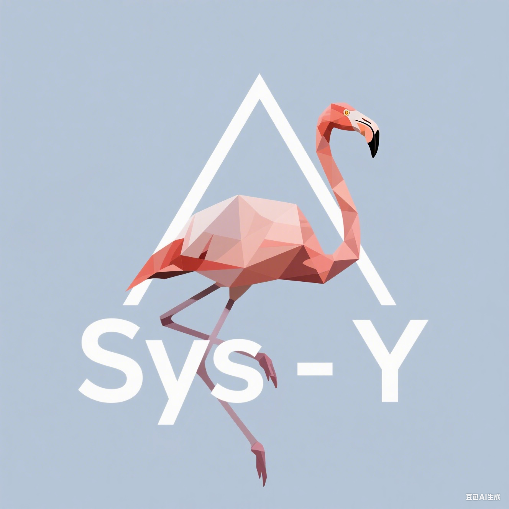

# Sys-Y Compiler

<p align="center">
  
</p>

A comprehensive Sys-Y language compiler with advanced debugging capabilities and extensive testing framework.

## ✨ Key Improvements & Features

### Enhanced Test Framework
- **Modular debugging options**: Separate flags for token, AST, IR, and IR execution
- **Dual comparison modes**: Backend assembly testing vs IR-level correctness checking
- **Performance profiling**: Runtime measurement and analysis with detailed logging
- **Colored terminal output**: Clear visual feedback with success/failure indicators
- **Comprehensive cleaning**: Automated cleanup of all generated artifacts

### Advanced Debug System
- **Granular debug controls**: Fine-tuned debugging via `debug.h` macros
- **Multi-level IR execution**: Brief and detailed execution tracing
- **Variable analysis**: Offset mapping and type analysis debugging
- **Branch tracking**: Detailed branch result monitoring

### Robust Test Infrastructure  
- **TOML-based configuration**: Structured test case organization
- **Multiple test categories**: Custom, functional, performance, and extended tests
- **Automated test discovery**: Recursive scanning and configuration generation
- **Cross-platform support**: QEMU-based RISC-V emulation with native fallback

## Environment Requirements

This project is tested on Ubuntu 24.04. We recommend using this environment for optimal compatibility.

### 1. Python Dependencies

Python 3.10+ is required with the following packages:

```bash
sudo apt install python3-toml python3-colorama
```

Or using pip in a virtual environment:

```bash
pip install toml colorama
```

### 2. Compilers

Install clang for building the compiler and RISC-V GCC for cross-compilation:

```bash
sudo apt install clang gcc-13-riscv64-linux-gnu
```

### 3. QEMU Emulator

For running RISC-V test cases:

```bash
sudo apt install qemu-user
```

## 🚀 Quick Start

### Building the Compiler

```bash
# Build the compiler using the provided task
make
# Or use VS Code task: "build compiler"
```

### Building Required Libraries

Before running tests, build the RISC-V library:

```bash
make lib
```

## 🧪 Advanced Testing Framework

Our enhanced test.py script provides comprehensive testing capabilities with multiple output levels and debugging options. Each parameter serves a specific purpose for different stages of compiler development and debugging.

### Quick Setup

1. **Generate Test Configuration:**
```bash
python test.py --generate-config
```
This scans your test directory structure and creates `test/config.toml` with all discovered test cases organized by category.

2. **Build Required Libraries:**
```bash
make lib
```

### Test Case Structure

Each test case follows this standardized structure:

```text
test_case_folder/
    ├── case_name.sy          # Source file (SysY language)
    ├── case_name.in          # Input data (optional)
    └── case_name.out         # Expected output
```

**Generated Files During Testing:**
```text
test_case_folder/
    ├── case_name.tk          # Tokenization output (--token)
    ├── case_name.json        # AST output (--ast)
    ├── case_name.ir          # IR representation (--ir)
    ├── case_name.ir_res      # IR execution results (--ir_exec)
    ├── case_name.s           # Assembly output (default)
    ├── case_name.res         # Final execution results
    ├── case_name.time        # Runtime measurements
    └── diff.log              # Differences when test fails
``` 

## 🔧 Debug System Configuration

The debug system provides granular control over compiler internals through `debug.h`. Edit this file to enable specific debugging features before building.

### How to Use debug.h

1. **Edit debug.h** to enable desired debugging features:
```cpp
// Example debug.h configuration
#define DEBUG_EXEC_BRIEF 1          // Enable brief IR execution trace
#define DEBUG_EXEC_DETAIL 0         // Disable detailed execution info
#define DEBUG_HYM_SEE_VAR2OFFSET_TABLE 1  // Show variable offset mapping
```

2. **Rebuild the compiler** after changes:
```bash
make clean && make
```

3. **Run tests** with debugging enabled:
```bash
python test.py -c ./test/custom/hello_world --ir --ir_exec --verbose
```

## 🎯 test.py Detailed Usage Guide

### Parameter Categories

#### Basic Test Execution

**1. Run Single Test Case**
```bash
python test.py -c ./test/custom/hello_world
```
- **Purpose:** Test a specific case during development
- **Output:** Basic pass/fail result with runtime
- **Use When:** Debugging a specific algorithm or feature

**2. Run All Configured Tests**  
```bash
python test.py -f ./test/config.toml
```
- **Purpose:** Full regression testing
- **Output:** Summary of all test results
- **Use When:** Before committing changes or releases

#### Debugging and Analysis Parameters

**3. Verbose Output (`--verbose`)**
```bash
python test.py -c ./test/custom/array_test --verbose
```
- **Purpose:** See detailed error messages and compilation output
- **Shows:** Compiler stderr/stdout, detailed failure reasons
- **Use When:** Investigating compilation failures or unexpected behavior

**Example Output:**
```
[DEBG] Running test: array_test
[DEBG] Compile stdout: IR generation completed
[DEBG] Compile stderr: Warning: unused variable 'temp'
[PASS] array_test                      45.23 ms    12.34 ms
```

**4. Token Analysis (`--token`)**
```bash
python test.py -c ./test/custom/lexer_test --token --verbose
```
- **Purpose:** Debug lexical analysis and tokenization
- **Generates:** `case_name.tk` with token stream
- **Use When:** Fixing lexer bugs, adding new language features

**Example .tk Output:**
```
KEYWORD        int
IDENTIFIER     main
LPAREN         (
RPAREN         )
LBRACE         {
KEYWORD        return
NUMBER         0
SEMICOLON      ;
RBRACE         }
```

**5. AST Generation (`--ast`)**
```bash
python test.py -c ./test/custom/parser_test --ast --verbose
```
- **Purpose:** Debug syntax analysis and AST construction
- **Generates:** `case_name.json` with structured AST
- **Use When:** Fixing parser bugs, verifying syntax tree structure

**Example .json Output:**
```json
{
   "type": "CompUnit",
   "functions": [{
      "type": "FuncDef",
      "name": "main",
      "returnType": "int",
      "body": {
         "type": "Block",
         "statements": [...]
      }
   }]
}
```

**6. IR Generation (`--ir`)**
```bash
python test.py -c ./test/custom/semantic_test --ir --verbose  
```
- **Purpose:** Debug semantic analysis and IR generation
- **Generates:** `case_name.ir` with intermediate representation
- **Use When:** Fixing semantic analysis, optimizing IR generation

**Example .ir Output:**
```
int main()
	0: call t_0, global()
	1: return 3
end

void global()
	0: return null
end

GVT:
  // Global Variable Table if Exists
```

**7. IR Execution (`--ir_exec`)**
```bash
python test.py -c ./test/custom/execution_test --ir --ir_exec --verbose
```
- **Purpose:** Test IR interpreter and execution correctness
- **Generates:** `case_name.ir_res` with execution results
- **Use When:** Verifying IR semantics before backend compilation

**8. IR-Level Testing (`--ir_diff`)**
```bash
python test.py -c ./test/custom/ir_correctness --ir --ir_exec --ir_diff
```
- **Purpose:** Compare IR execution results instead of assembly output
- **Generates:** `ir_diff.log` instead of `backend_diff.log`
- **Use When:** Testing frontend correctness independent of backend

#### Utility Parameters

**9. Clean Generated Files (`--clean`)**
```bash
python test.py --clean
```
- **Purpose:** Remove all generated test artifacts
- **Removes:** `.ir`, `.ir_res`, `.json`, `.tk`, `.s`, `.log`, `.res`, `.exe`, `.time`
- **Use When:** Starting fresh, disk space management

**10. Configuration Generation (`--generate-config`)**
```bash
python test.py --generate-config
```
- **Purpose:** Auto-discover and configure all test cases
- **Creates:** `test/config.toml` with organized test categories
- **Use When:** Adding new test cases, reorganizing test structure

#### Advanced Scenarios

**11. Custom Compiler Path**
```bash
python test.py -c ./test/performance/matrix_mult --compiler ./my_optimized_compiler
```
- **Use When:** Testing different compiler builds or versions

**12. Custom Emulator**
```bash
python test.py -c ./test/custom/riscv_specific --emulator qemu-riscv64-static
```
- **Use When:** Using different QEMU versions or native execution

**13. Combined Debugging**
```bash
python test.py -c ./test/custom/complex_case --token --ast --ir --ir_exec --verbose
```
- **Purpose:** Full pipeline debugging from tokens to execution
- **Use When:** Comprehensive analysis of compiler pipeline

### Workflow Examples

#### Frontend Development Workflow
```bash
# 1. Test lexer
python test.py -c ./test/custom/new_syntax --token --verbose

# 2. Test parser  
python test.py -c ./test/custom/new_syntax --ast --verbose

# 3. Test semantic analysis
python test.py -c ./test/custom/new_syntax --ir --verbose

# 4. Test IR execution
python test.py -c ./test/custom/new_syntax --ir --ir_exec --ir_diff
```

#### Performance Analysis Workflow
```bash
# 1. Run performance tests
python test.py -f ./test/config.toml | grep performance

# 2. Analyze runtime (check test/summary.log)
cat test/summary.log

# 3. Profile specific slow cases
python test.py -c ./test/performance/slow_case --verbose
```

#### Bug Investigation Workflow  
```bash
# 1. Clean and run failing test
python test.py --clean
python test.py -c ./test/failing_case --verbose

# 2. Check compilation artifacts
python test.py -c ./test/failing_case --ir --ir_exec --token --ast --verbose

# 3. Compare IR vs backend results
python test.py -c ./test/failing_case --ir_diff
``` 

### Test Case Organization

Download formal test cases from our [Latest Release](https://github.com/HugoPhi/sysyc/releases/tag/v0.0.1) and extract to the test directory:

```text
test/
├── custom/           # Your custom test cases
├── formal/           # Official test cases (compiler2025, bisheng cup)
│   ├── performance/  # Performance benchmarks  
│   └── basic/
│       ├── functional/     # Basic functionality tests
│       └── h_functional/   # Extended functionality tests
└── config.toml      # Test configuration
```

### 📊 Understanding Test Output

**Terminal Output Format:**
```
[PASS] hello_world                     12.45 ms      8.32 ms
[FAIL] matrix_mult                     156.78 ms     89.12 ms  
[PASS] fibonacci                       5.23 ms       3.45 ms
```
- **Status**: PASS/FAIL indicator with color coding
- **Test Name**: Case name from folder
- **Compilation Time**: Time to compile the test case  
- **Execution Time**: Time to run the generated code

**Generated Log Files:**
- `test/summary.log`: All results sorted by runtime performance
- `case_folder/diff.log`: Detailed differences when test fails
- `case_folder/ir_diff.log`: IR-level differences (with `--ir_diff`)

### Quick Reference

```bash
# Essential commands
python test.py --generate-config              # Setup test configuration
python test.py --clean                        # Clean all generated files
python test.py -c ./test/custom/case_name     # Test single case
python test.py -f ./test/config.toml          # Test all cases

# Debugging specific stages  
python test.py -c ./test/case --token         # Debug lexer
python test.py -c ./test/case --ast           # Debug parser
python test.py -c ./test/case --ir            # Debug semantic analysis
python test.py -c ./test/case --ir_exec       # Debug IR execution

# Advanced debugging
python test.py -c ./test/case --ir_diff       # Compare IR results
python test.py -c ./test/case --verbose       # Show detailed output
```

## Implemented Features
### Mid-end Optimization

#### IR Optimization Pipeline
- **Mem2Reg (Memory to Register Promotion)**: Converts local variable memory accesses into SSA-form register operations, eliminating redundant memory accesses.
- **Sparse Conditional Constant Propagation (SCCP)**: Propagates and folds constant values at compile time.
- **InstCombine (Instruction Combination)**: Merges and simplifies adjacent instructions, such as constant folding and algebraic simplification.
- **GVN (Global Value Numbering)**: Identifies and eliminates redundant computations by optimizing based on value equivalence.
- **LICM (Loop Invariant Code Motion)**: Moves loop-invariant code outside of loops to reduce computations inside loops.
- **Function Inlining**: Inlines small function calls at the call site to reduce function call overhead.
- **LCSSA (Loop-Closed SSA Form)**: Converts SSA form to loop-closed form to simplify loop analysis and optimization.
- **Loop Unrolling**: Duplicates the loop body multiple times to reduce loop control overhead and improve instruction-level parallelism.
- **Dead Loop Elimination**: Identifies and removes loops that will never execute.
- **DCE (Dead Code Elimination)**: Removes unreachable code and unused instructions.
- **CFG Simplification**: Removes empty jump blocks and unreachable basic blocks to simplify the control flow graph.

##### SSA Form Management
- **PHI Elimination**: Converts SSA-form PHI nodes into conventional register assignments.
- **SSA Destruction**: Converts SSA form into traditional register assignment form.

### Backend Optimization
- **Register Allocation**: Linear scan and graph coloring register assignment strategies

## 🚧 Planned Features

### IR Optimization Pipeline
- **Advanced Loop Optimizations**: Loop vectorization, loop fusion, and loop interchange
- **Block Ordering**: Reorders basic blocks based on dominator tree order to improve cache locality.

### Backend Enhancements
- **Advanced Register Allocation**: Graph coloring with spill optimization
- **Instruction Scheduling**: Pipeline-aware instruction reordering
- **Peephole Optimization**: Local instruction sequence optimization

## 📄 License

This project is part of the compiler design coursework and follows academic usage guidelines.
