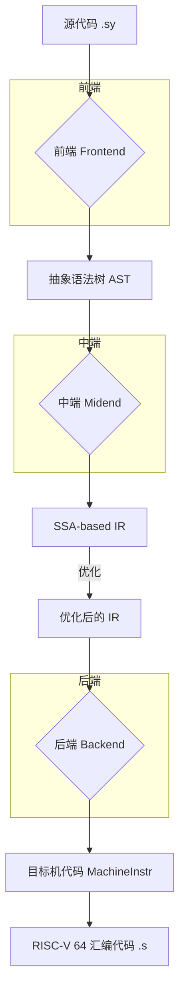
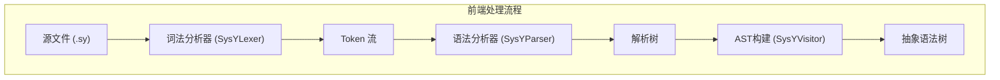
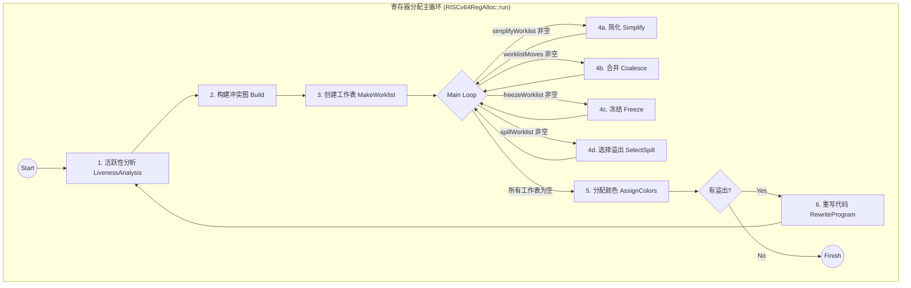

# 编译器核心技术与优化详解

本文档深入剖析 mysysy 编译器的内部实现，重点阐述其在前端、中端和后端所采用的核心编译技术及优化算法，并结合具体实现函数进行说明。

## 1. 编译器整体架构

本编译器采用经典的三段式架构，将编译过程清晰地划分为前端、中端和后端三个主要部分。每个部分处理不同的抽象层级，并通过定义良好的接口（AST, IR）进行通信，实现了高度的模块化。



- **前端 (Frontend)**：负责词法、语法、语义分析，将 SysY 源代码解析为抽象语法树 (AST)。
- **中端 (Midend)**：基于 AST 生成与具体机器无关的中间表示 (IR)，并在此基础上进行深入的分析和优化。
- **后端 (Backend)**：将优化后的 IR 翻译成目标平台（RISC-V 64）的汇编代码。

---

## 2. 前端技术 (Frontend)

前端的核心任务是进行语法和语义的分析与验证，其工作流程如下：



- **词法与语法分析**:
  - **技术**: 采用 **ANTLR (ANother Tool for Language Recognition)** 框架。通过在 `frontend/SysY.g4` 文件中定义的上下文无关文法，ANTLR 能够自动生成高效的 LL(*) 词法分析器 (`SysYLexer.cpp`) 和语法分析器 (`SysYParser.cpp`)。
  - **实现**: 词法分析器将字符流转换为记号 (Token) 流，语法分析器则根据文法规则将记号流组织成一棵解析树 (Parse Tree)。这棵树精确地反映了源代码的语法结构。

- **AST 构建**:
  - **技术**: 应用 **访问者 (Visitor) 设计模式** 遍历 ANTLR 生成的解析树。该模式将数据结构（解析树）与作用于其上的操作（AST构建逻辑）解耦。
  - **实现**: `frontend/SysYVisitor.cpp` 中定义了具体的遍历逻辑。在遍历过程中，会构建一个比解析树更抽象、更面向编译需求的**抽象语法树 (Abstract Syntax Tree, AST)**。AST 忽略了纯粹的语法细节（如括号、分号），只保留了核心的语义结构，是前端传递给中端的接口。

---

## 3. 中端技术与优化 (Midend)

中端是编译器的核心，所有与目标机器无关的分析和优化都在此阶段完成。

### 3.1. 中间表示 (IR) 及设计要点

- **技术**: 设计了一种三地址码（Three-Address Code）风格的中间表示，其形式和设计哲学深受 **LLVM IR** 的启发。IR 的核心特征是采用了**静态单赋值 (Static Single Assignment, SSA)** 形式。
- **实现**: `midend/IR.cpp` 定义了 IR 的核心数据结构，如 `Instruction`, `BasicBlock`, `Function` 和 `Module`。`midend/SysYIRGenerator.cpp` 负责将前端的 AST 转换为这种 IR。在 SSA 形式下，每个变量只被赋值一次，使得变量的定义-使用关系（Def-Use Chain）变得异常清晰，极大地简化了后续的优化算法。通过继承并重写 SysYBaseVisitor 类，遍历 AST 节点生成自定义 IR，并在 IR 生成阶段实现了简单的常量传播和公共子表达式消除（CSE）。
- **设计要点**：
  - **`alloca` 指令集中管理**：  
  所有 `alloca` 指令统一放置在入口基本块，并与实际计算指令分离。这有助于后续指令调度器专注于优化计算密集型指令的执行顺序，避免内存分配指令的干扰。
  - **消除 `fallthrough` 现象**：  
  通过确保所有基本块均以终结指令结尾，消除基本块间的 `fallthrough`，简化了控制流图（CFG）的构建和分析。这一做法提升了编译器整体质量，使中端各类 Pass 的编写和维护更加规范和高效。

### 3.2. 核心优化详解

编译器的分析和优化被组织成一系列独立的“遍”（Pass）。每个 Pass 都是一个独立的算法模块，对 IR 进行特定的分析或变换。这种设计具有高度的模块化和可扩展性。

#### 3.2.1. SSA 构建与解构

- **Mem2Reg (`Mem2Reg.cpp`)**:
  - **目标**: 将对栈内存 (`alloca`) 的 `load`/`store` 操作，提升为对虚拟寄存器的直接操作，并构建 SSA 形式。
  - **技术**: 该过程是实现 SSA 的关键。它依赖于**支配树 (Dominator Tree)** 分析，通过寻找变量定义块的**支配边界 (Dominance Frontier)** 来确定在何处插入 **Φ (Phi) 函数**。
  - **实现**: `Mem2RegContext::run` 驱动此过程。首先调用 `isPromotableAlloca` 识别所有仅被 `load`/`store` 使用的标量 `alloca`。然后，`insertPhis` 根据支配边界信息在必要的控制流汇合点插入 `phi` 指令。最后，`renameVariables` 递归地遍历支配树，用一个模拟的值栈来将 `load` 替换为栈顶的 SSA 值，将 `store` 视为对栈的一次 `push` 操作，从而完成重命名。值得一提的是，由于我们在IR生成阶段就将所有alloca指令统一放置在入口块，极大地简化了Mem2Reg遍的实现和支配树分析的计算。

- **Reg2Mem (`Reg2Mem.cpp`)**:
  - **目标**: 执行 `Mem2Reg` 的逆操作，将程序从 SSA 形式转换回基于内存的表示。这通常是为不支持 SSA 的后端做准备的**SSA解构 (SSA Destruction)** 步骤。
  - **技术**: 为每个 SSA 值（指令结果、函数参数）在函数入口创建一个 `alloca` 栈槽。然后，在每个 SSA 值的定义点之后插入一个 `store` 将其存入对应的栈槽；在每个使用点之前插入一个 `load` 从栈槽中取出值。
  - **实现**: `Reg2MemContext::run` 驱动此过程。`allocateMemoryForSSAValues` 为所有需要转换的 SSA 值创建 `alloca` 指令。`rewritePhis` 特殊处理 `phi` 指令，在每个前驱块的末尾插入 `store`。`insertLoadsAndStores` 则处理所有非 `phi` 指令的定义和使用，插入相应的 `store` 和 `load`。虽然

#### 3.2.2. 常量与死代码优化

- **SCCP (`SCCP.cpp`)**:
  - **目标**: 稀疏条件常量传播。在编译期计算常量表达式，并利用分支条件为常数的信息来消除死代码，比简单的常量传播更强大。
  - **技术**: 这是一种基于数据流分析的格理论（Lattice Theory）的优化。它为每个变量维护一个值状态，可能为 `Top` (未定义), `Constant` (某个常量值), 或 `Bottom` (非常量)。同时，它跟踪基本块的可达性，如果一个分支的条件被推断为常量，则其不可达的后继分支在分析中会被直接忽略。
  - **实现**: `SCCPContext::run` 驱动整个分析过程。它维护一个指令工作列表和一个边工作列表。`ProcessInstruction` 和 `ProcessEdge` 函数交替执行，不断地从 IR 中传播常量和可达性信息，直到达到不动点为止。最后，`PropagateConstants` 和 `SimplifyControlFlow` 将推断出的常量替换到代码中，并移除死块。

- **DCE (`DCE.cpp`)**:
  - **目标**: 简单死代码消除。移除那些计算结果对程序输出没有贡献的指令。
  - **技术**: 采用**标记-清除 (Mark and Sweep)** 算法。从具有副作用的指令（如 `store`, `call`, `return`）开始，反向追溯其操作数，标记所有相关的指令为“活跃”。
  - **实现**: `DCEContext::run` 实现了此算法。第一次遍历时，通过 `isAlive` 函数识别出具有副作用的“根”指令，然后调用 `addAlive` 递归地将所有依赖的指令加入 `alive_insts` 集合。第二次遍历时，所有未被标记为活跃的指令都将被删除。
  - **未来规划**: 后续开发更多分析遍会为DCE收集更多的IR信息，能够迭代出更健壮的DEC遍。

#### 3.2.3. 控制流图 (CFG) 优化

- **实现**: `SysYIRCFGOpt.cpp` 中定义了一系列用于清理和简化控制流图的 Pass。
  - **`SysYDelInstAfterBrPass`**: 删除分支指令后的死代码。
  - **`SysYDelNoPreBLockPass`**: 通过从入口块开始的图遍历（BFS），识别并删除所有不可达的基本块。
  - **`SysYDelEmptyBlockPass`**: 识别并删除仅包含一条无条件跳转指令的空块，将其前驱直接重定向到其后继。
  - **`SysYBlockMergePass`**: 如果一个块 A 只有一个后继 B，且 B 只有一个前驱 A，则将 A 和 B 合并为一个块。
  - **`SysYCondBr2BrPass`**: 如果一个条件分支的条件是常量，则将其转换为一个无条件分支。
  - **`SysYAddReturnPass`**: 确保所有没有终结指令的函数出口路径都有一个 `return` 指令，以保证 CFG 的完整性。

#### 3.2.4. 其他优化

#### 3.3. 核心分析遍

  为了为优化遍收集信息，最大程度发掘程序优化潜力，我们目前设计并实现了以下关键的分析遍：

- **支配树分析 (Dominator Tree Analysis)**:
  - **技术**: 通过计算每个基本块的支配节点，构建出一棵支配树结构。我们在计算支配节点时采用了**逆后序遍历（RPO, Reverse Post Order）**，以保证数据流分析的收敛速度和正确性。在计算直接支配者（Idom, Immediate Dominator）时，采用了经典的**Lengauer-Tarjan（LT）算法**，该算法以高效的并查集和路径压缩技术著称，能够在线性时间内准确计算出每个基本块的直接支配者关系。
  - **实现**: `Dom.cpp` 实现了支配树分析。该分析为每个基本块分配其直接支配者，并递归构建整棵支配树。支配树是许多高级优化（尤其是 SSA 形式下的优化）的基础。例如，Mem2Reg 需要依赖支配树来正确插入 Phi 指令，并在变量重命名阶段高效遍历控制流图。此外，循环相关优化（如循环不变量外提）也依赖于支配树信息来识别循环头和循环体的关系。

- **活跃性分析 (Liveness Analysis)**:
  - **技术**: 活跃性分析用于确定在程序的某一特定点上，哪些变量的值在未来会被用到。我们采用**经典的不动点迭代算法**，在数据流分析框架下，逆序遍历基本块，迭代计算每个基本块的 `live-in` 和 `live-out` 集合，直到收敛为止。这种方法简单且易于实现，能够满足大多数编译优化的需求。
  - **未来规划**: 若后续对分析效率有更高要求，可考虑引入如**工作列表算法**或者**转化为基于SSA的图可达性分析**等更高效的算法，以进一步提升大型函数或复杂控制流下的分析性能。
  - **实现**: `Liveness.cpp` 提供了活跃性分析。该分析采用经典的数据流分析框架，迭代计算每个基本块的 `live-in` 和 `live-out` 集合。活跃性信息是死代码消除（DCE）、寄存器分配等优化的必要前置步骤。通过准确的活跃性分析，可以识别出无用的变量和指令，从而为后续优化遍提供坚实的数据基础。

### 3.4. 未来的规划

基于现有的成果，我们规划将中端能力进一步扩展，近期我们重点将放在循环相关的分析和函数内联的实现，以期大幅提升最终程序的性能。

- **循环优化**:
  我们正在开发一个健壮的分析遍来准确识别程序中的循环结构，并通过对已识别的循环进行规范化的转换遍，为后续的向量化、并行化工作做铺垫。并通过循环不变量提升、循环归纳变量分析与强度削减等优化提升循环相关代码的执行效率。
- **函数内联**:
  函数内联能够将简单函数（可能需要收集更多信息）内联到call指令相应位置，减少栈空间相关变动，并且为其他遍发掘优化空间。
- **`LLVM IR`格式化**:
  我们将为所有的IR设计并实现通用的打印器方法，使得IR能够显式化为可编译运行的LLVM IR，通过编排脚本和调用llvm相关工具链，我们能够绕过后端编译运行中间代码，为验证中端正确性提供系统化的方法，同时减轻后端开发bug溯源的压力。

---

## 4. 后端技术与优化 (Backend)

后端负责将经过优化的、与机器无关的 IR 转换为针对 RISC-V 64 位架构的汇编代码。

### 4.1. 栈帧布局 (Stack Frame Layout)

在函数调用发生时，后端需要在栈上创建一个**栈帧 (Stack Frame)** 来存储局部变量、传递参数和保存寄存器。本编译器采用的栈帧布局遵循 RISC-V 调用约定，结构如下：

```
高地址  +-----------------------------+
        |       ...                   |
        |       函数参数 (8+)         |  <-- 调用者传入的、放不进寄存器的参数
        +-----------------------------+
        |       返回地址 (ra)         |  <-- sp 在函数入口指向的位置
        +-----------------------------+
        |       旧的帧指针 (s0/fp)    |
        +-----------------------------+  <-- s0/fp 在函数序言后指向的位置
        |       被调用者保存的寄存器  |
        |       (Callee-Saved Regs)   |
        +-----------------------------+
        |       局部变量 (Alloca)     |
        +-----------------------------+
        |       寄存器溢出区域        |
        |       (Spill Slots)         |
        +-----------------------------+
        |       为调用其他函数预留的  |
        |       出参空间 (Out-Args)   |
低地址  +-----------------------------+  <-- sp 在函数序言后指向的位置
```

- **实现**: `PrologueEpilogueInsertion.h` 和 `EliminateFrameIndices.h` 中的 Pass 负责生成函数序言（prologue）和尾声（epilogue）代码，来构建和销毁上述栈帧。`EliminateFrameIndices` 会将所有对抽象栈槽（如局部变量、溢出槽）的访问，替换为对帧指针 `s0` 或栈指针 `sp` 的、带有具体偏移量的访问。

### 4.2. 指令选择 (Instruction Selection)

- **目标**: 将抽象的 IR 指令高效地翻译成具体的目标机指令序列。
- **技术**: 采用 **基于 DAG (Directed Acyclic Graph) 的模式匹配** 算法。
- **实现**: `RISCv64ISel.cpp` 中的 `RISCv64ISel::select()` 驱动此过程。`selectBasicBlock()` 为每个基本块调用 `build_dag()` 来构建一个操作的 DAG，然后通过 `select_recursive()` 对 DAG 进行自底向上的遍历和匹配。在 `selectNode()` 函数中，通过一个大的 `switch` 语句，为不同类型的 DAG 节点（如 `BINARY`, `LOAD`, `STORE`）匹配最优的指令序列。例如，一个 IR 的加法指令，如果其中一个操作数是小常数，会被直接匹配为一条 `ADDIW` 指令，而不是 `LI` 和 `ADDW` 两条指令。

### 4.3. 寄存器分配 (Register Allocation)

- **目标**: 将无限的虚拟寄存器映射到有限的物理寄存器上，并优雅地处理寄存器不足（溢出）的情况。
- **技术**: 实现了经典的**基于图着色 (Graph Coloring) 的全局寄存器分配算法**，这是一种强大但复杂的全局优化方法。
- **实现**: `RISCv64RegAlloc.cpp` 中的 `RISCv64RegAlloc::run()` 是主入口。它在一个循环中执行分配，直到没有寄存器需要溢出为止。其内部流程极其精密，如下图所示：



  1. **`analyzeLiveness()`**: 对机器指令进行数据流分析，计算出每个虚拟寄存器的活跃范围。
  2. **`build()`**: 根据活跃性信息构建**冲突图 (Interference Graph)**。如果两个虚拟寄存器同时活跃，则它们冲突，在图中连接一条边。
  3. **`makeWorklist()`**: 将图节点（虚拟寄存器）根据其度数放入不同的工作列表，为着色做准备。
  4. **核心着色阶段 (The Loop)**:
      - **`simplify()`**: 贪心地移除图中度数小于物理寄存器数量的节点，并将其压入栈中。这些节点保证可以被成功着色。
      - **`coalesce()`**: 尝试将传送指令 (`MV`) 的源和目标节点合并，以消除这条指令。合并的条件基于 **Briggs** 或 **George** 启发式，以避免使图变得不可着色。
      - **`freeze()`**: 当一个与传送指令相关的节点无法合并也无法简化时，放弃对该传送指令的合并希望，将其“冻结”为一个普通节点。
      - **`selectSpill()`**: 当所有节点都无法进行上述操作时（即图中只剩下高度数的节点），必须选择一个节点进行**溢出 (Spill)**，即决定将其存放在内存中。
  5. **`assignColors()`**: 在所有节点都被处理后，从栈中依次弹出节点，并根据其已着色邻居的颜色，为它选择一个可用的物理寄存器。
  6. **`rewriteProgram()`**: 如果 `assignColors()` 阶段发现有节点被标记为溢出，此函数会被调用。它会修改机器指令，为溢出的虚拟寄存器插入从内存加载（`lw`/`ld`）和存入内存（`sw`/`sd`）的代码。然后，整个分配过程从步骤 1 重新开始。

### 4.4. 后端特定优化

在寄存器分配前后，后端还会进行一系列针对目标机（RISC-V）特性的优化。

#### 4.4.1. 指令调度 (Instruction Scheduling)

- **寄存器分配前调度 (`PreRA_Scheduler.cpp`)**:
  - **目标**: 在寄存器分配前，通过重排指令来提升性能。主要目标是**隐藏加载延迟 (Load Latency)**，即尽早发出 `load` 指令，使其结果能在需要时及时准备好，避免流水线停顿。同时，由于此时使用的是无限的虚拟寄存器，调度器有较大的自由度，但也可能因为过度重排而延长虚拟寄存器的生命周期，从而增加寄存器压力。
  - **实现**: `scheduleBlock()` 函数会识别出基本块内的调度边界（如 `call` 或终结指令），然后在每个独立的区域内调用 `scheduleRegion()`。当前的实现是一种简化的列表调度，它会优先尝试将加载指令 (`LW`, `LD` 等) 在不违反数据依赖的前提下，尽可能地向前移动。

- **寄存器分配后调度 (`PostRA_Scheduler.cpp`)**:
  - **目标**: 在寄存器分配完成之后，对指令序列进行最后一轮微调。此阶段调度的主要目标与分配前不同，它旨在解决由寄存器分配过程本身引入的性能问题，例如：
    - **缓解溢出代价**: 将因溢出（Spill）而产生的 `load` 指令（从栈加载）尽可能地提前，远离其使用点；将 `store` 指令（存入栈）尽可能地推后，远离其定义点。
    - **消除伪依赖**: 寄存器分配器可能会为两个原本不相关的虚拟寄存器分配同一个物理寄存器，从而引入了虚假的写后读（WAR）或写后写（WAW）依赖。Post-RA 调度可以尝试解开这些伪依赖，为指令重排提供更多自由度。
  - **实现**: `scheduleBlock()` 函数实现了此调度器。它采用了一种非常保守的**局部交换 (Local Swapping)** 策略。它迭代地检查相邻的两条指令，在 `canSwapInstructions()` 函数确认交换不会违反任何数据依赖（RAW, WAR, WAW）或内存依赖后，才执行交换。这种方法虽然不如全局列表调度强大，但在严格的 Post-RA 约束下是一种安全有效的优化手段。

#### 4.4.2. 强度削减 (Strength Reduction)

- **除法强度削减 (`DivStrengthReduction.cpp`)**:
  - **目标**: 将机器指令中昂贵的 `DIV` 或 `DIVW` 指令（当除数为编译期常量时）替换为一系列更快、计算成本更低的指令组合。
  - **技术**: 基于数论中的**乘法逆元 (Multiplicative Inverse)** 思想。对于一个整数除法 `x / d`，可以找到一个“魔数” `m` 和一个移位数 `s`，使得该除法可以被近似替换为 `(x * m) >> s`。这个过程需要处理复杂的符号、取整和溢出问题。
  - **实现**: `runOnMachineFunction()` 实现了此优化。它会遍历机器指令，寻找以常量为除数的 `DIV`/`DIVW` 指令。`computeMagic()` 函数负责计算出对应的魔数和移位数。然后，根据除数是 2 的幂、1、-1 还是其他普通数字，生成不同的指令序列，包括 `MULH` (取高位乘积), `SRAI` (算术右移), `ADD`, `SUB` 等，来精确地模拟定点数除法的效果。

#### 4.4.3. 窥孔优化 (Peephole Optimization)

- **目标**: 在生成最终汇编代码之前，对相邻的机器指令序列进行局部优化，以消除冗余操作和利用目标机特性。
- **技术**: 窥孔优化是一种简单而高效的局部优化技术。它通过一个固定大小的“窥孔”（通常是 2-3 条指令）来扫描指令序列，寻找可以被更优指令序列替换的模式。
- **实现**: `PeepholeOptimizer::runOnMachineFunction()` 实现了此 Pass。它包含了一系列模式匹配和替换规则，主要包括：
  - **冗余移动消除**: `mv x, y` 后跟着一条使用 `x` 的指令 `op z, x, ...`，如果 `x` 之后不再活跃，则将 `op` 的操作数直接替换为 `y`，并移除 `mv` 指令。
  - **冗余加载消除**: `sw r1, mem; lw r2, mem` -> `sw r1, mem; mv r2, r1`。如果 `r1` 和 `r2` 是同一个寄存器，则直接移除 `lw`。
  - **地址计算优化**: `addi t1, base, imm1; lw t2, imm2(t1)` -> `lw t2, (imm1+imm2)(base)`。将两条指令合并为一条，减少了指令数量和中间寄存器的使用。
  - **指令合并**: `addi t1, t0, imm1; addi t2, t1, imm2` -> `addi t2, t0, (imm1+imm2)`。合并连续的立即数加法。

### 4.5. 局限性与未来工作

根据项目中的 `TODO` 列表和源代码分析，当前实现存在一些可改进之处：

- **寄存器分配**:
  - **`CALL` 指令处理**: 当前对 `CALL` 指令的 `use`/`def` 分析不完整，没有将所有调用者保存的寄存器标记为 `def`，这可能导致跨函数调用的值被错误破坏。
  - **溢出处理**: 当前所有溢出的虚拟寄存器都被简单地映射到同一个物理寄存器 `t6` 上，这会引入大量不必要的 `load`/`store`，并可能导致 `t6` 成为性能瓶颈。
- **IR 设计**:
  - 随着 SSA 的引入，IR 中某些冗余信息（如基本块的 `args` 参数）可以被移除，以简化设计。
- **优化**:
  - 当前的优化主要集中在标量上。可以引入更多面向循环的优化（如循环不变代码外提 LICM、归纳变量分析 IndVar）和过程间优化来进一步提升性能。
