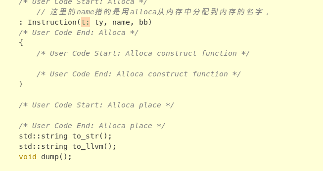
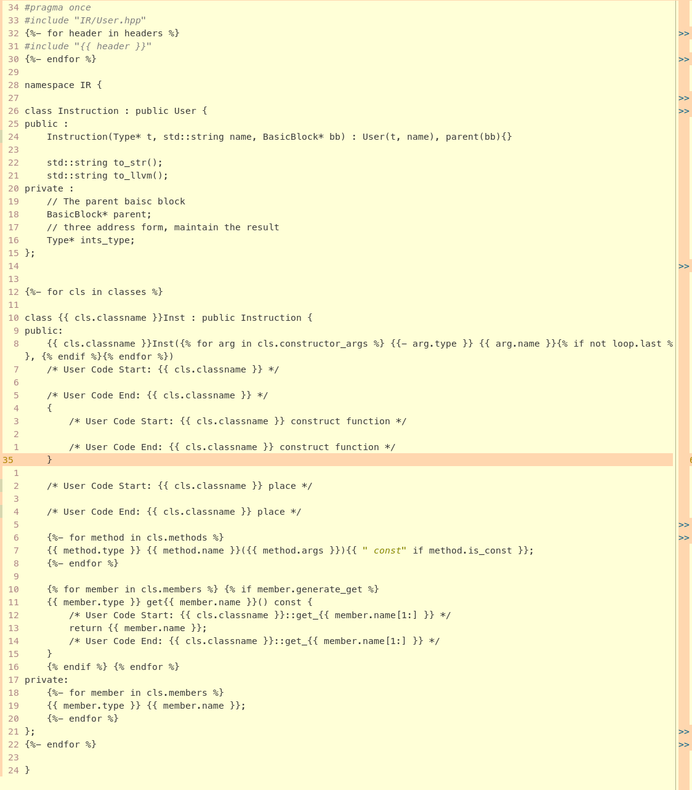
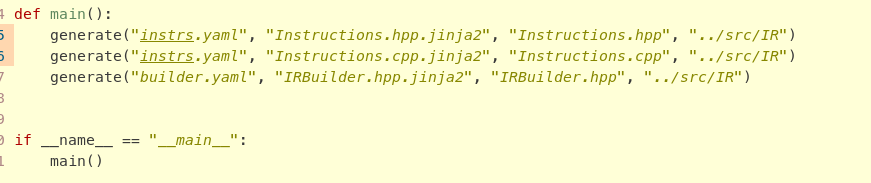

# 提取出写代码的过程中的机械化的部分

- 原因：
    - 指令，不管是中间表示还是后端，指令都是三地址的形式。存在重复的结构，这些对应到代码里结构是非常相似的，写的时候通称是复制+微调
    - 对几十个类，写到后面容易脑子抽了，漏了需要微调的地方。机器脑子不会抽

- 解决方式：
    - python jinja2 + yaml的配置文件（参考llvm 的后端用td添加硬件信息）(最初打算用json写配置文件的，但是json的{} 太多， 不还行看层次结构不好看， 换行存在太多 只有 } 的行)

- 更多需求
    - 像在使用模板生成的代码基础上接着改（在不同的抽象层微操），单纯jinja2更新配置文件后重新生成代码会覆盖之前的代码
        - 参考stm32cubemx生成代码的样子，添加几个用户代码区间。添加像这样端的“锚点”，“安全的代码区间”（在generate.py中的正则表达式中识别start和end的注释，将整个代码分成一个个区间，"Start-End"注释的区间外替换成新的代码，区间内的保留）

    - jinja2 模板（ {{ some_thing }} 的结构是不是很像 vue 中加载数据的方式 ）

        - 存在的问题： 上面说的安全区间可能不安全，正则表达式根据“User Code Start/End:” 后的内容来确定代码区间，如果两块代码区间的注释一样就会存在第一块把后面的区间替代成同一个内容。安全的操作是在运行generate.py之前先git commit一下存个档，生成后用git diff看一下哪些地方发生了变化。
    

# 生成的代码
- 别的不用管，我已经抽象完了
```python
    generate(cfg, template, target, target_dir)
```
- 其中
    - cfg ： yaml配置文件
    - template : jinja2 模板
    - target : 生成的文件名
    - target_dir ： 目标路径


## generate.py

        按： 写一点，跑一下，结果理想（现在暂时是理想的），抽象出一个函数（方法）

```python

import yaml
from pathlib import Path
import re 
import shutil

def extract_user_code_blocks(content):
    pattern = re.compile(r'/\*\s*User Code Start:(.*?)\s*\*/\n(.*?)/\*\s*User Code End:\1\s*\*/', re.DOTALL)
    return {key.strip(): body for key, body in pattern.findall(content)}

def merge_generated_with_existing(old_text, new_text):
    old_blocks = extract_user_code_blocks(old_text)

    def replace_block(match):
        key = match.group(1).strip()
        if key in old_blocks:
            return f'/* User Code Start: {key} */\n{old_blocks[key]}/* User Code End: {key} */'
        else:
            return match.group(0)

    pattern = re.compile(r'/\*\s*User Code Start:(.*?)\s*\*/\n(.*?)/\*\s*User Code End:\1\s*\*/', re.DOTALL)
    return pattern.sub(replace_block, new_text)

def get_config(cfg: str):
    with open(cfg) as f :
        return yaml.safe_load(f)

    print(f"Not find {cfg}")

def generate(cfg, template, target, target_dir):
    class_data = get_config(cfg)

    env = Environment(loader=FileSystemLoader("."))
    cpp_template = env.get_template(template)
    # 渲染模板为新代码
    new_code = cpp_template.render(class_data)
    if Path(target_dir + '/' + target).exists():
        # copy to tmp dir
        dst_dir = Path("../tmp")
        dst_file = dst_dir / (target + '.old')
        shutil.copy(target_dir + '/' + target, dst_file)
        print(f'save the old version at {dst_file}')

    try:
        with open("../tmp/" + target + ".old", "r") as f:
            old_code = f.read()
        merged_code = merge_generated_with_existing(old_code, new_code)
        with open(target_dir + '/' + target, "w") as f:
            f.write(merged_code)
        print(f"合并成功，已输出 {target}（保留旧实现）")
    except FileNotFoundError:
        with open(target_dir + '/' + target, "w") as f:
            f.write(new_code)
        print(f"初次生成，已输出 {target}")

def main():
    generate("instrs.yaml", "Instructions.hpp.jinja2", "Instructions.hpp", "../src/IR")
    generate("instrs.yaml", "Instructions.cpp.jinja2", "Instructions.cpp", "../src/IR")
    generate("builder.yaml", "IRBuilder.hpp.jinja2", "IRBuilder.hpp", "../src/IR")


if __name__ == "__main__":
    main()
```

# IR 生成
- 进行中（前面的是用模板生成代码，，生成的是一堆类，而这些代码其是是对中间表示的一个抽象，然后我在编译前端在语义分析的基础上再进行一趟翻译，把前端的信息通过实例化中间表示的这些类传递到中间表示）
- 在这个信息传递的过程中，补充前面设计中端时不清楚的细节，前面是一个骨架，需要不断的思考-设计-重新设计
- 抽象!抽象！！抽象！！！

## 要抽些啥呢
- 中间表示
    1. 对值抽象
    2. 对内存抽象
    3. 对控制流抽象
- backend（在中间表示的基础上）
     1. 硬件（寄存器）的抽象
     2. 流水线的抽象
