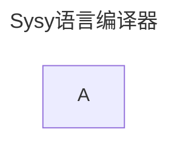
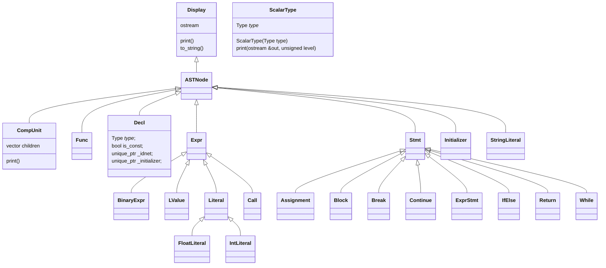
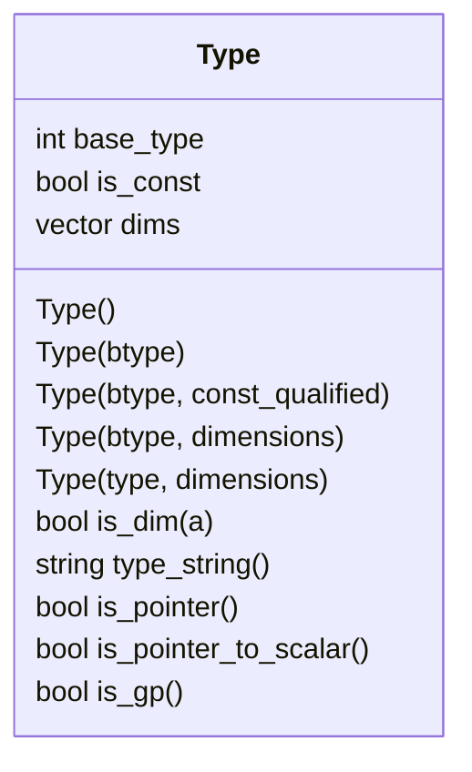
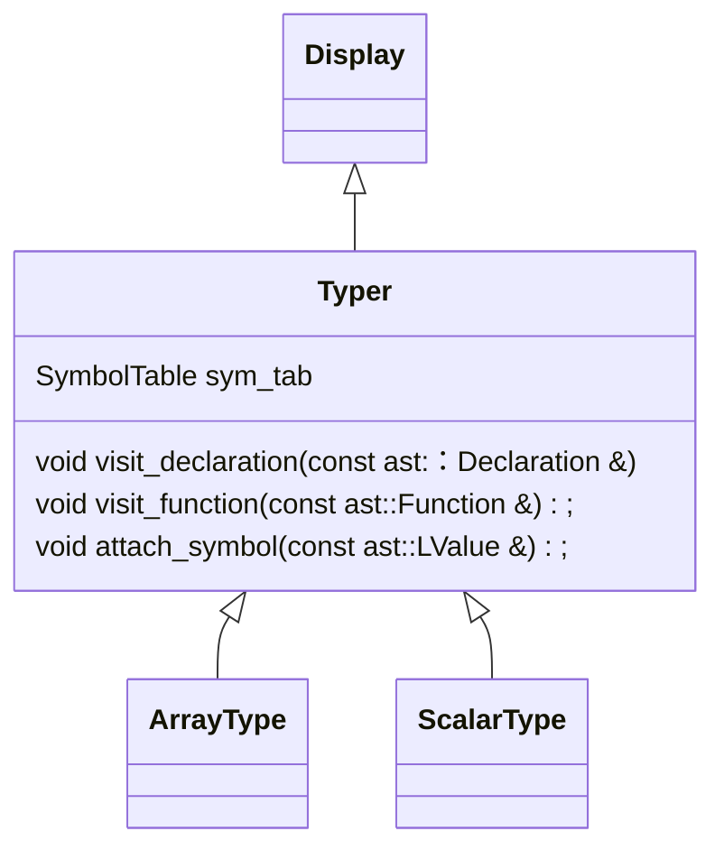

# FrontEnd

## 整个编译器架构
- antlr_parset --> ast -(type check, sema)-> ir -(main function check, opt)->  backend_4rv

* [AST](#AST)
* [Sysy22的类型](#Sysy22的类型)

## AST

* AST类图

```mermaid
classDiagram

direction TB

%% ===== Display / ASTNode Base Classes =====
class Display {
    +print(out: ostream, level: unsigned)
}

class ASTNode

%% ===== Type System =====
class SysyType
class ScalarType {
    +_type_: int
    +ScalarType(type: int)
    +type(): int
    +print(out: ostream, level: unsigned)
}
class ArrayType {
    +_type_: ScalarType
    +_dimensions: vector<Expr*>
    +_omit_first_dimension: bool
    +ArrayType(type: ScalarType, dimensions: vector<Expr*>, omit: bool)
    +base_type(): int
    +dimensions(): vector<Expr*>
    +omit_first_dimension(): bool
    +print(out: ostream, level: unsigned)
}
SysyType <|-- ScalarType
SysyType <|-- ArrayType
Display <|-- SysyType

%% ===== Ident =====
class Ident {
    +ident_name: string
    +Ident(name: string, mangle: bool)
    +identifier(): string
    +print(out: ostream, level: unsigned)
}
Display <|-- Ident

%% ===== Param =====
class Param {
    +_ident: Ident
    +_type: SysyType*
    +Param(ident: Ident, type: SysyType*)
    +ident(): Ident
    +type(): SysyType*
    +print(out: ostream, level: unsigned)
}
Display <|-- Param

%% ===== Func =====
class Func {
    +_type: ScalarType*
    +_ident: Ident
    +_params: vector<Param*>
    +_body: Block*
    +Func(type: ScalarType*, ident: Ident, params: vector<Param*>, body: Block*)
    +type(): ScalarType*
    +ident(): Ident
    +params(): vector<Param*>
    +body(): Block*
    +print(out: ostream, level: unsigned)
}
ASTNode <|-- Func
Display <|-- Func

%% ===== Expr =====
class Expr
ASTNode <|-- Expr
class BinaryExpr {
    +_op: BinaryOp
    +_lhs: Expr*
    +_rhs: Expr*
    +BinaryExpr(op: BinaryOp, lhs: Expr*, rhs: Expr*)
    +op(): BinaryOp
    +lhs(): Expr*
    +rhs(): Expr*
    +print(out: ostream, level: unsigned)
}
Expr <|-- BinaryExpr

class UnaryExpr {
    +_op: UnaryOp
    +_operand: Expr*
    +UnaryExpr(op: UnaryOp, operand: Expr*)
    +op(): UnaryOp
    +operand(): Expr*
    +print(out: ostream, level: unsigned)
}
Expr <|-- UnaryExpr

class LValue {
    +_ident: Ident
    +_indices: vector<Expr*>
    +LValue(ident: Ident, indices: vector<Expr*>)
    +ident(): Ident
    +indices(): vector<Expr*>
    +print(out: ostream, level: unsigned)
}
Expr <|-- LValue

class Call {
    +_func: Ident
    +_args: vector<variant<Expr*, StringLiteral>>
    +_line: unsigned
    +Call(func: Ident, args: vector<...>, line: unsigned)
    +func(): Ident
    +args(): vector<...>
    +line(): unsigned
    +print(out: ostream, level: unsigned)
}
Expr <|-- Call

class Literal
Expr <|-- Literal
class IntLiteral {
    +_value: int32_t
    +IntLiteral(value: int32_t)
    +value(): int32_t
    +print(out: ostream, level: unsigned)
}
Literal <|-- IntLiteral
class FloatLiteral {
    +_value: float
    +FloatLiteral(value: float)
    +value(): float
    +print(out: ostream, level: unsigned)
}
Literal <|-- FloatLiteral

%% ===== Stmt =====
class Stmt
ASTNode <|-- Stmt
class Assignment {
    +_lhs: LValue*
    +_rhs: Expr*
    +Assignment(lhs: LValue*, rhs: Expr*)
    +lhs(): LValue*
    +rhs(): Expr*
    +print(out: ostream, level: unsigned)
}
Stmt <|-- Assignment
class Return {
    +_rets: Expr*
    +Return(rets: Expr*)
    +rets(): Expr*
    +print(out: ostream, level: unsigned)
}
Stmt <|-- Return
class Break {
    +print(out: ostream, level: unsigned)
}
Stmt <|-- Break
class Continue {
    +print(out: ostream, level: unsigned)
}
Stmt <|-- Continue
class ExprStmt {
    +_expr: Expr*
    +ExprStmt(expr: Expr*)
    +expr(): Expr*
    +print(out: ostream, level: unsigned)
}
Stmt <|-- ExprStmt
class WhileStmt {
    +_cond: Expr*
    +_body: Stmt*
    +WhileStmt(cond: Expr*, body: Stmt*)
    +cond(): Expr*
    +body(): Stmt*
    +print(out: ostream, level: unsigned)
}
Stmt <|-- WhileStmt
class IfStmt {
    +_cond: Expr*
    +_then: Stmt*
    +_else: Stmt*
    +IfStmt(cond: Expr*, then: Stmt*, else: Stmt*)
    +cond(): Expr*
    +then(): Stmt*
    +else_stmt(): Stmt*
    +print(out: ostream, level: unsigned)
}
Stmt <|-- IfStmt
class Block {
    +_children: vector<variant<Stmt*, Decl*>>
    +Block(children: vector<...>)
    +children(): vector<...>
    +print(out: ostream, level: unsigned)
}
Stmt <|-- Block

%% ===== Initializer =====
class Initializer {
    +_value: variant<Expr*, vector<Initializer*>>
    +Initializer(expr: Expr*)
    +Initializer(list: vector<Initializer*>)
    +value(): auto
    +print(out: ostream, level: unsigned)
}
ASTNode <|-- Initializer
Display <|-- Initializer

%% ===== Decl =====
class Decl {
    +_type: SysyType*
    +_is_const: bool
    +_ident: Ident*
    +_init: Initializer*
    +Decl(type: SysyType*, is_const: bool, ident: Ident*, init: Initializer*)
    +type(): SysyType*
    +ident(): Ident*
    +init(): Initializer*
    +is_const(): bool
    +print(out: ostream, level: unsigned)
}
ASTNode <|-- Decl
Display <|-- Decl

%% ===== CompUnits =====
class CompUnits {
    +_children: vector<variant<Decl*, Func*>>
    +CompUnits(children: vector<...>)
    +children(): vector<...>
    +print(out: ostream, level: unsigned)
}
ASTNode <|-- CompUnits
Display <|-- CompUnits
```

# Sysy22的类型（定义）

* 基本类型
    | 类型| |
    | --- | --- |
    | int | --- |
    | int array | --- |
    | float | --- |
    | float array| --- |
    | void | 仅修饰函数 |
* 类图

## 类型检查
- 使用访问者遍历完ANTLR得到的解析树后，得到AST，然后再用访问者（类型检查，也就是语义分析器）进行类型检测
* Typer类图

