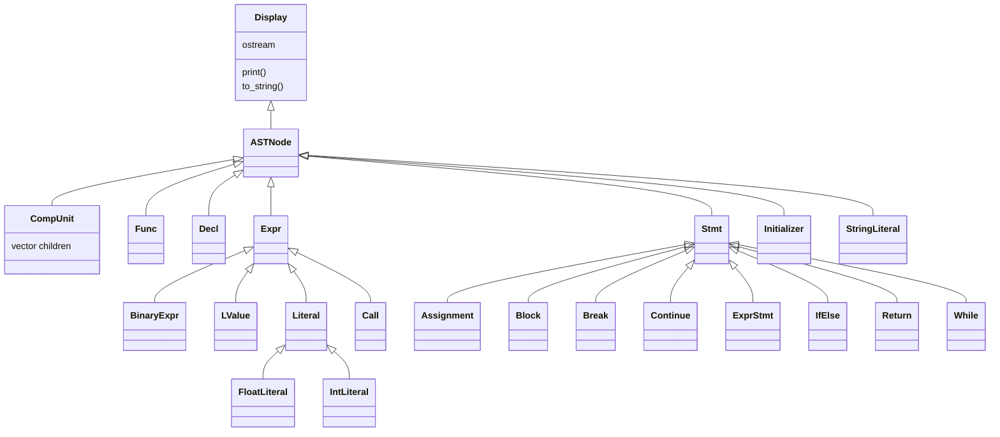
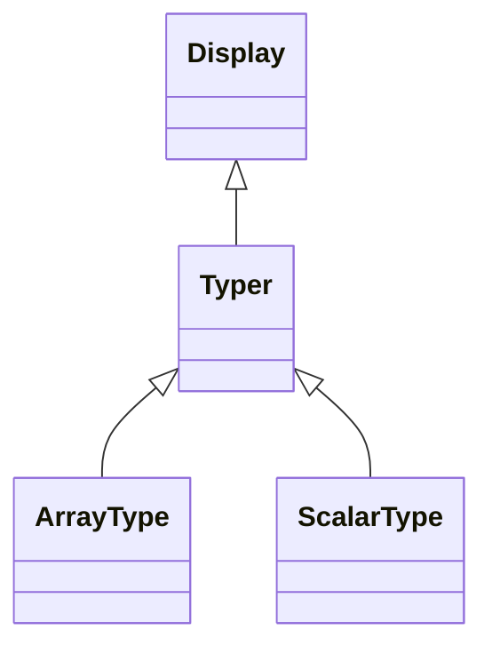

# AST Class graph

## AST

```mermaid
classDiagram

Display <|-- ASTNode
Display : print()
Display : to_string()
Display : ostream

ASTNode <|-- CompUnit
ASTNode <|-- Func
ASTNode <|-- Decl
ASTNode <|-- Expr
ASTNode <|-- Stmt

ASTNode <|-- Initializer 
ASTNode <|-- StringLiteral 

Expr <|-- BinaryExpr 
Expr <|-- LValue 
Expr <|-- Literal 
Expr <|-- Call 

Literal <|-- FloatLiteral
Literal <|-- IntLiteral

Stmt <|-- Assignment 
Stmt <|-- Block 
Stmt <|-- Break 
Stmt <|-- Continue 
Stmt <|-- ExprStmt
Stmt <|-- IfElse
Stmt <|-- Return 
Stmt <|-- While

CompUnit : vector children

```

## Typer

```mermaid
classDiagram
Display <|-- Typer
Typer <|-- ArrayType 
Typer <|-- ScalarType
```
