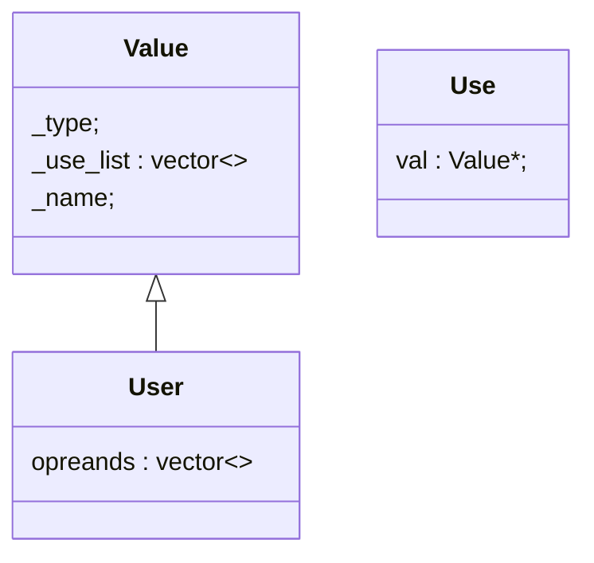
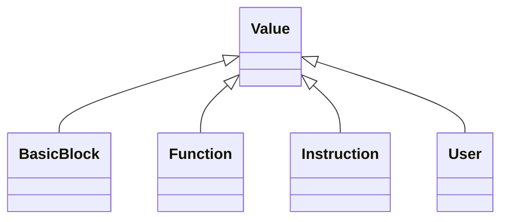

# IR 

## Def-Use chain

```mermaid
classDiagram

class Value {
    _type;
    _use_list : vector<>
    _name;
}

class Use {
    val : Value*;
}

class User {
   opreands : vector<> 
}

Value <|-- User
```

## The Derived
* In namespace middleend::ir

```mermaid
classDiagram
class Value 

Value <|-- BasicBlock 
Value <|-- Function 
Value <|-- Instruction 

Value <|-- User

```
