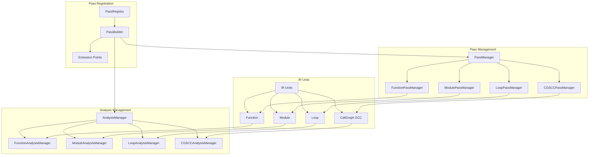
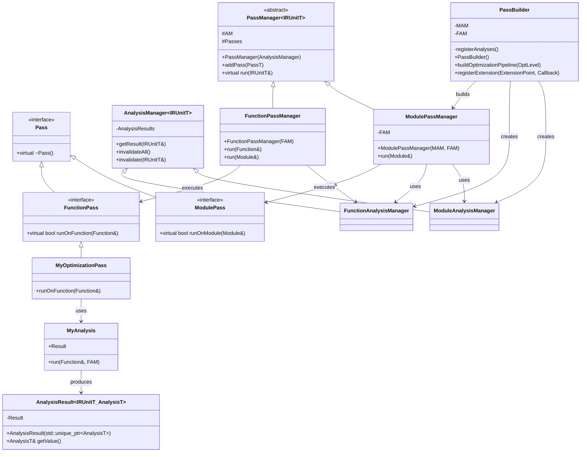

## The pass manager in LLVM

```mermaid
graph TD
    subgraph "Pass Management"
        PM[PassManager] --> FPM[FunctionPassManager]
        PM --> MPM[ModulePassManager]
        PM --> LCPM[LoopPassManager]
        PM --> CGPM[CGSCCPassManager]
    end

    subgraph "Analysis Management"
        AM[AnalysisManager] --> FunctionAM[FunctionAnalysisManager]
        AM --> ModuleAM[ModuleAnalysisManager]
        AM --> LoopAM[LoopAnalysisManager]
        AM --> CGAM[CGSCCAnalysisManager]
    end

    subgraph "Pass Registration"
        PR[PassRegistry] --> PB[PassBuilder]
        PB --> EP[Extension Points]
    end

    PB --> PM
    PB --> AM
    
    subgraph "IR Units"
        IRU[IR Units] --> Function
        IRU --> Module
        IRU --> Loop
        IRU --> CGSCC[CallGraph SCC]
    end
    
    FPM --> Function
    MPM --> Module
    LCPM --> Loop
    CGPM --> CGSCC
    
    Function --> FunctionAM
    Module --> ModuleAM
    Loop --> LoopAM
    CGSCC --> CGAM
```

* Class Diagram 

```mermaid
classDiagram
    %% 核心接口
    class Pass {
        <<interface>>
        +virtual ~Pass()
    }
    class ModulePass {
        <<interface>>
        +virtual bool runOnModule(Module&)
    }
    class FunctionPass {
        <<interface>>
        +virtual bool runOnFunction(Function&)
    }
    
    Pass <|-- ModulePass
    Pass <|-- FunctionPass
    
    %% 分析结果和分析管理器
    class AnalysisResult~IRUnitT_AnalysisT~ {
        -Result
        +AnalysisResult(std::unique_ptr~AnalysisT~)
        +AnalysisT& getValue()
    }
    
    class AnalysisManager~IRUnitT~ {
        -AnalysisResults
        +getResult(IRUnitT&)
        +invalidateAll()
        +invalidate(IRUnitT&)
    }
    
    class ModuleAnalysisManager {
    }
    
    class FunctionAnalysisManager {
    }
    
    AnalysisManager~Module~ <|-- ModuleAnalysisManager
    AnalysisManager~Function~ <|-- FunctionAnalysisManager
    
    %% Pass 管理器
    class PassManager~IRUnitT~ {
        <<abstract>>
        #AM
        #Passes
        +PassManager(AnalysisManager)
        +addPass(PassT)
        +virtual run(IRUnitT&)
    }
    
    class ModulePassManager {
        -FAM
        +ModulePassManager(MAM, FAM)
        +run(Module&)
    }
    
    class FunctionPassManager {
        +FunctionPassManager(FAM)
        +run(Function&)
        +run(Module&)
    }
    
    PassManager~Module~ <|-- ModulePassManager
    PassManager~Function~ <|-- FunctionPassManager
    
    %% Pass 构建器
    class PassBuilder {
        -MAM
        -FAM
        -registerAnalyses()
        +PassBuilder()
        +buildOptimizationPipeline(OptLevel)
        +registerExtension(ExtensionPoint, Callback)
    }
    
    %% 示例分析和 Pass
    class MyAnalysis {
        +Result
        +run(Function&, FAM)
    }
    
    class MyOptimizationPass {
        +runOnFunction(Function&)
    }
    
    FunctionPass <|-- MyOptimizationPass
    
    %% 关系
    PassBuilder --> ModuleAnalysisManager : creates
    PassBuilder --> FunctionAnalysisManager : creates
    PassBuilder --> ModulePassManager : builds
    ModulePassManager --> ModuleAnalysisManager : uses
    ModulePassManager --> FunctionAnalysisManager : uses
    FunctionPassManager --> FunctionAnalysisManager : uses
    ModulePassManager --> ModulePass : executes
    FunctionPassManager --> FunctionPass : executes
    MyAnalysis --> AnalysisResult : produces
    MyOptimizationPass --> MyAnalysis : uses
```
