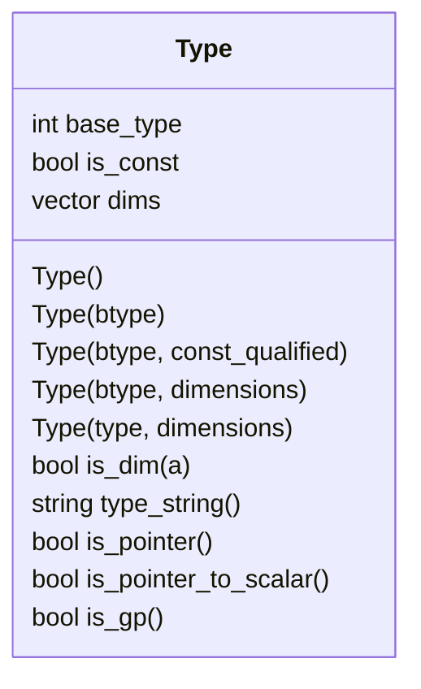

# Sysy22的类型

* 基本类型
    | 类型| |
    | --- | --- |
    | int | --- |
    | int array | --- |
    | float | --- |
    | float array| --- |
    | void | 仅修饰函数 |
* classDiagram

```mermaid
classDiagram
class Type

Type : int base_type
Type : bool is_const
Type : vector dims

 Type:Type()
 Type:Type( btype)
 Type:Type( btype,  const_qualified)
 Type:Type( btype, dimensions)
 Type:Type( type, dimensions)

Type : bool is_dim(a)
Type : string type_string()
Type : bool is_pointer()
Type : bool is_pointer_to_scalar()
Type : bool is_gp()
```
