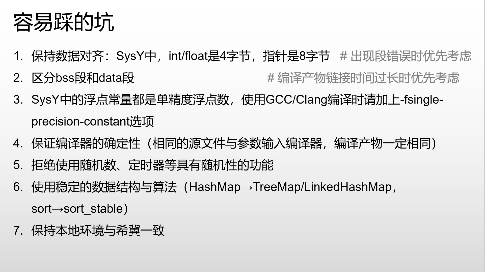

# SysY 编译器

## 设计文档

详细[设计文档](docs/设计文档.md)请参见 `doc` 文件夹，包含前端、IR、优化、后端等各阶段的设计与实现说明。

---

## 操作

### 生成词法语法

```bash
java -jar /path/to/antlr-4.13.2-complete.jar -Dlanguage=Cpp -no-listener -visitor -o frontend/generate SysY.g4
```

antlr4 下载使用教程请查看[清华大学编译原理课设教程](https://decaf-lang.github.io/minidecaf-tutorial/docs/contest/frontend.html)

### 编译

```bash
rm -rf build
mkdir build
cd build
# 如果需要调试信息，可以使用 Debug 模式
# 如果需要优化，可以使用 Release 模式
cmake ..
cmake -DCMAKE_BUILD_TYPE=Debug ..
cmake -DCMAKE_BUILD_TYPE=Release ..

make
```

### 运行脚本

本项目提供了 `run.sh` 脚本，支持一键编译、运行、测试、调试和结果对比等多种常用操作。常用参数及用法如下：

```bash
# 编译项目（进入 build 目录并 make）
./run.sh -build

# 清理并重新 cmake + make（全量重构编译）
./run.sh -rebuild

# 对 INPUT_DIR 下所有 .sy 文件生成 IR 中间代码，输出到 OUTPUT_DIR
./run.sh -ir

# 生成优化后的 IR（可加 -O0/-O1/-O2 指定优化等级）
./run.sh -ir -O1

# 生成 RISC-V 汇编代码（可加 -O0/-O1/-O2 指定优化等级）
./run.sh -riscv -O2

# gdb 调试所有 .sy 文件，遇到崩溃自动进入 gdb 并打印回溯
./run.sh -gdb

# 启动 qemu-riscv64 虚拟机环境
./run.sh -qemu

# 将 OUTPUT_DIR 下的 .s/.in/.out 文件通过 scp 传输到 qemu 虚拟机
./run.sh -transfer

# 对比不同优化等级下生成的 IR 文件行数，便于分析优化效果
./run.sh -diff
```

- `INPUT_DIR` 和 `OUTPUT_DIR` 可在脚本顶部灵活配置，支持多套测试用例和输出目录切换。
- 支持自动创建输出目录、超时检测、彩色输出、详细进度提示等功能，便于批量测试和调试。
- 脚本参数可组合使用，具体用法详见脚本注释或直接运行 `./run.sh` 查看帮助。

### qemu-riscv64 模拟器运行

```bash
# qemu 启动
qemu-system-riscv64 \
-machine virt -nographic -m 2048 -smp 4 \
-kernel /usr/lib/u-boot/qemu-riscv64_smode/uboot.elf \
-device virtio-net-device,netdev=eth0 \
-netdev user,id=eth0,hostfwd=tcp::2222-:22 \
-device virtio-rng-pci \
-drive file=ubuntu-24.04.2-preinstalled-server-riscv64.img,format=raw,if=virtio

# 传递文件到 qemu 虚拟机
./run.sh -transfer
```

---

## 问题

### 一. 文法错误

1.'SysY.g4' 中的 exp 文法有误，但是目前没有修正。

### 二. 语法分析

1.isConst 属性需要向上传递-->已处理  
2.visitConstDecl 没有把 const 修饰的变量设置为常量表达式-->已处理  
3.constExpr 如何处理-->已处理  
4.exp 和 stmt 的 line 设置有问题，无法用于 debug-->已处理

### 三. 语义分析

1.左值引用和表达式类型获取函数中对数组维度判断重复-->已处理  
2.省略第一维度的数组第一维度默认为-1，暂时不做处理，在中间代码生成时处理-->已处理，数组作为函数参数时退化为指针

### 四. 中间代码生成

1.未实现函数多基本块时是否都有返回值-->对应语义分析-->已处理  
2.表达式暂时未支持 string 类型-->已处理  
3.未处理库函数-->已处理  
4.phi 还未生成-->已处理  
5.int 和 float 范围未检测-->不做处理  
6.数组下标未检测合法(是否大于 0)-->已处理

## 优化效果分析：

- 效果较好的优化：

  1. 常量传播
     在编译时将已知的常量值替换变量，减少运行时计算。
  2. 函数内联
     将函数体直接替换函数调用，避免调用开销（如压栈、跳转）。
  3. LICM (循环不变代码外提)
     将循环内不依赖迭代变量的计算移到循环外，避免重复计算。
  4. 寄存器分配 (图着色算法)
  5. GVN (全局值编号)
     识别程序中计算结果相同的表达式，复用已有计算结果。
  6. Mem2Reg (内存到寄存器转换)
     将内存中的变量转换为寄存器变量，减少内存访问开销。
  7. DCE (死代码删除)
     删除程序中永远不会执行的代码，减少不必要的计算。
  8. CFG 简化
     简化控制流图，去除不必要的分支和跳转，提高代码可读性和执行效率。
  9. Loop Unrolling (循环展开)
     将循环体展开，减少循环控制开销，提高性能。

- 效果一般的优化：

  1. instcombine
  2. 过程间死代码删除

## 容易踩的坑



C++ 标准库的 shared_ptr 的 == 运算符默认比较的是指针地址（即是否指向同一块内存），不会自动调用你自定义的 `operator==`。如果需要比较内容相等，需要使用 `get()` 方法获取裸指针进行比较。
